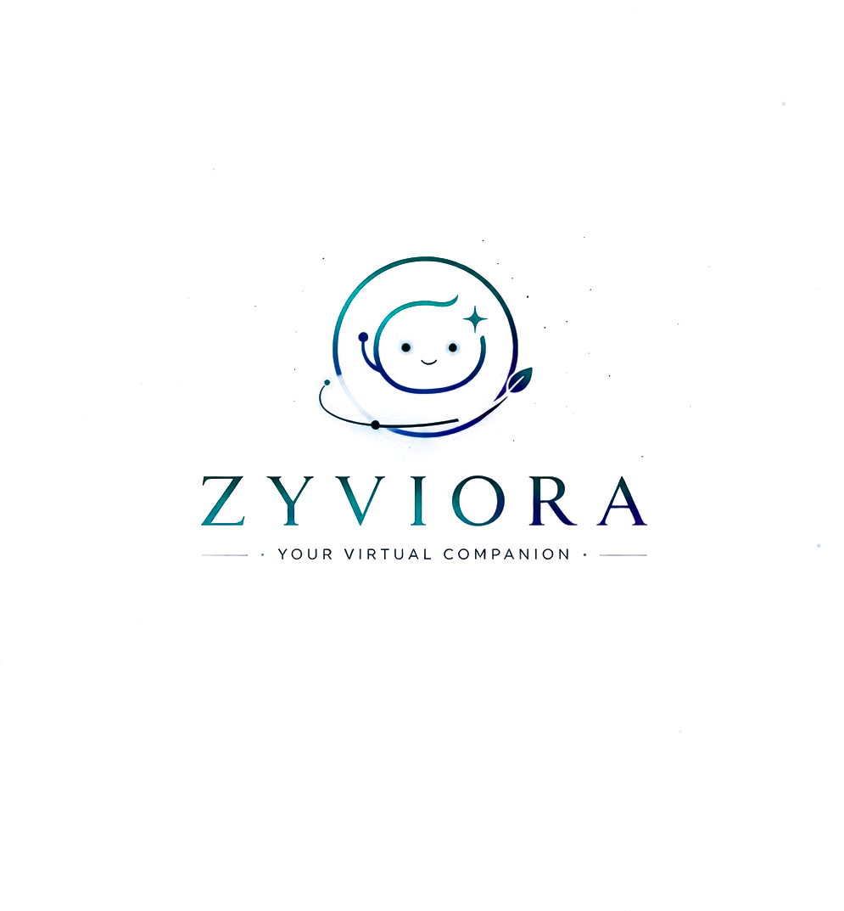

  
  <h1>Zyviora AI Companion</h1>
  
<em>Not Just an AI — A Companion That Cares.</em>

---

## 🌟 Overview

**Zyviora** is an intelligent, emotionally-aware web-based AI companion designed to boost productivity, track personal goals, and manage your emotional well-being. By blending lightning-fast local logic (`Prolog`) with advanced conversational generation (`Google Gemini AI`), Zyviora acts as a personalized assistant that learns from your habits and actively supports your mental health.

Featuring a cinematic **Premium Glassmorphism** and lightweight claymorphism UI, Zyviora visually represents a soothing ambient environment, complete with a custom fluid glowing tail cursor and smoothly animated UI micro-interactions.

---

## ✨ Core Features

*   **🧠 Hybrid AI Engine**: Uses `pyswip` (Prolog) for immediate, rule-based psychological responses and Google Gemini for deep, natural conversation.
*   **🗣️ Voice Mode Integration**: Speak naturally to Zyviora using the integrated Web Speech API.
*   **📈 Smart Dashboard Analytics**: Automatically constructs behavior models, charting your weekly mood history and goal completion rates.
*   **🗂️ Task Management**: Create, list, and complete pending tasks seamlessly within the chat interface, persisting across sessions in your dashboard.
*   **⏰ Smart Proactive Reminders**: Set precise natural-language relative or absolute timers that trigger proactive ping notifications even when idle.
*   **💻 System App Integration**: Built-in backend bridges via Python to automatically launch local system apps (e.g., "open calculator", "open calendar") right from the chat.
*   **💙 Emotional Check-Ins**: Dedicated UI pills for quick mood logging. Zyviora will remember your mood and actively follow up with you naturally.
*   **🎮 Built-In Mini-Games**: Defeat boredom with integrated logic games (Word Guess, Tic-Tac-Toe, Number Guess, etc.) directly in the chat!

---

## 🛠️ Technology Stack

**Frontend:**
*   HTML5 / CSS3 / Vanilla JavaScript
*   Custom advanced animations (Lerp-based Canvas Engine for mouse cursor, requestAnimationFrame)
*   Chart.js (Dashboard Analytics)
*   Advanced CSS Glassmorphism + Radial gradients

**Backend:**
*   Python 3 & Flask (Routing & API management)
*   SQLite + SQLAlchemy (Secure User & Hash Authentication)
*   Pyswip (Local Prolog logic processing)
*   Google Generative AI SDK (Gemini API for text generation)
*   `subprocess` & `webbrowser` modules (System-level app orchestrations)
*   Flask-Session & Flask-Limiter

---

## 🚀 Getting Started

Follow these instructions to run the Zyviora project locally on your machine.

### Prerequisites

1.  **Python 3.8+** installed.
2.  **SWI-Prolog** installed and correctly configured in your system `PATH` (Required for `pyswip` to function).
3.  A **Google Gemini API Key** (Get one from [Google AI Studio](https://aistudio.google.com/)).

### Installation

1. **Clone the Repository**
   \`\`\`bash
   git clone <your-repository-url>
   cd Project
   \`\`\`

2. **Create a Virtual Environment**
   \`\`\`bash
   python -m venv venv
   # On Windows:
   venv\\Scripts\\activate
   # On macOS/Linux:
   source venv/bin/activate
   \`\`\`

3. **Install Dependencies**
   \`\`\`bash
   pip install -r requirements.txt
   \`\`\`

4. **Environment Variables Setup**
   Create a \`.env\` file in the root directory and add your secret keys:
   \`\`\`env
   GEMINI_API_KEY=your_actual_api_key_here
   FLASK_SECRET_KEY=zyviora-super-secret-key
   \`\`\`

5. **Initialize to Validate Database**
   \`\`\`bash
   # Running the app the first time will automatically generate database.db and the instance/ folder
   python app.py
   \`\`\`

6. **Access the Application**
   Open your browser and navigate to:
   \`\`\`
   http://127.0.0.1:5000
   \`\`\`

---

## 📂 Project Structure

\`\`\`text
Project/
├── app.py                # Main Flask backend & routing
├── database.db           # Auto-generated SQLite user database
├── .env                  # Environment Variables (Ignored by git)
├── requirements.txt      # Python dependencies
├── prolog/
│   └── main.pl           # Prolog rules & logic core for Zyviora
├── static/
│   ├── css/              # Core Glassmorphism UI Style sheets
│   ├── js/
│   │   ├── cursor.js     # Modular custom canvas-based cursor
│   │   ├── dashboard.js  # Dashboard analytics & charts logic
│   │   ├── games.js      # Mini-game runtime engines
│   │   └── script.js     # Main Chat UI functionality & API interactions
│   └── (images)          # Logos, robots, and SVG avatars
└── templates/
    ├── index.html        # Premium Landing Page
    ├── chat.html         # Main Web Chat Interface
    ├── dashboard.html    # User Analytics UI
    ├── login.html        # Auth UI
    └── register.html     # Registration UI
\`\`\`

---

## 🎨 Design Philosophy

Zyviora steers away from harsh technical borders and flat UI. The user interacts through a "frosted window" to communicate with the Assistant, accompanied by very subtle 400% background gradient loops and frictionless hover transformations to ensure the platform feels alive, empathetic, and premium.

---

*Designed and Built by Teja.*
